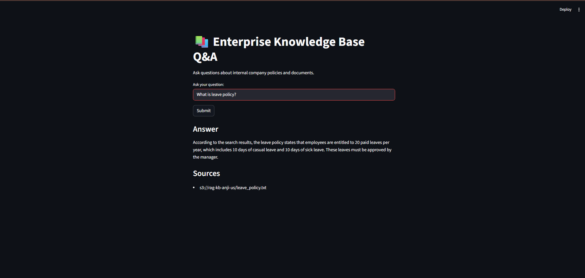
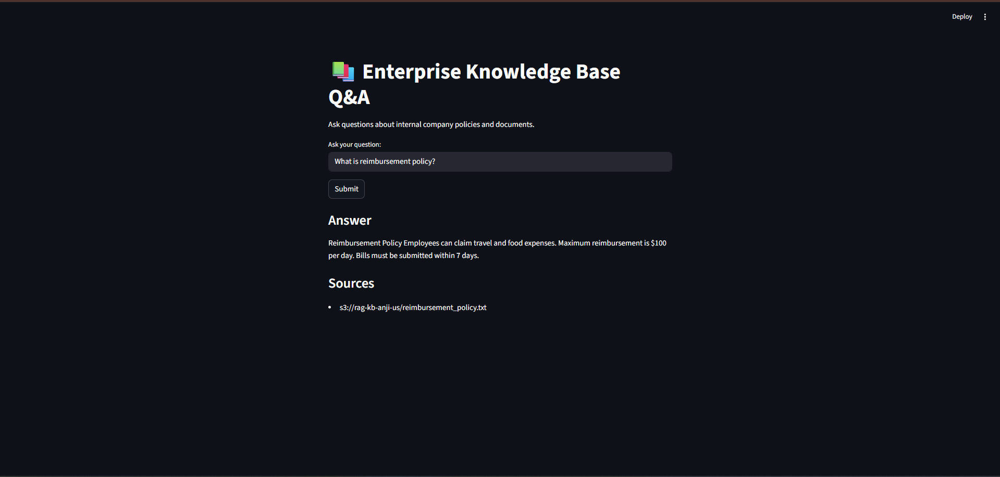
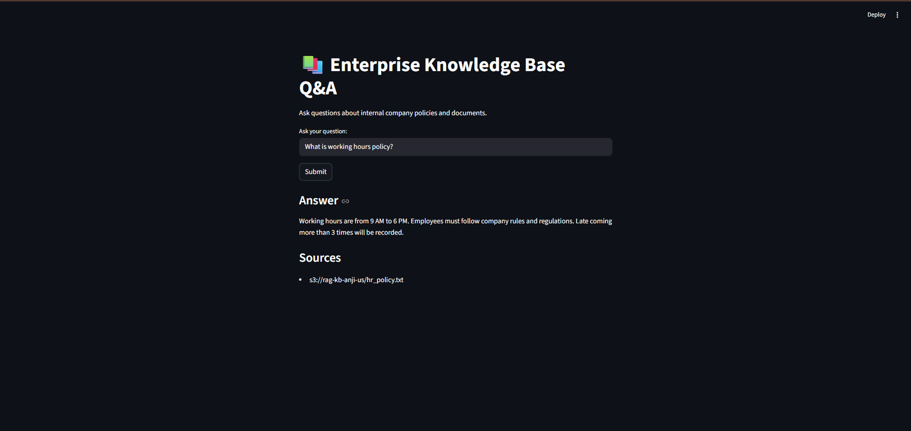
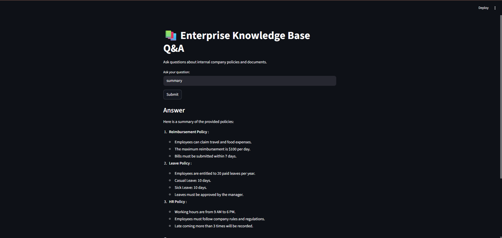
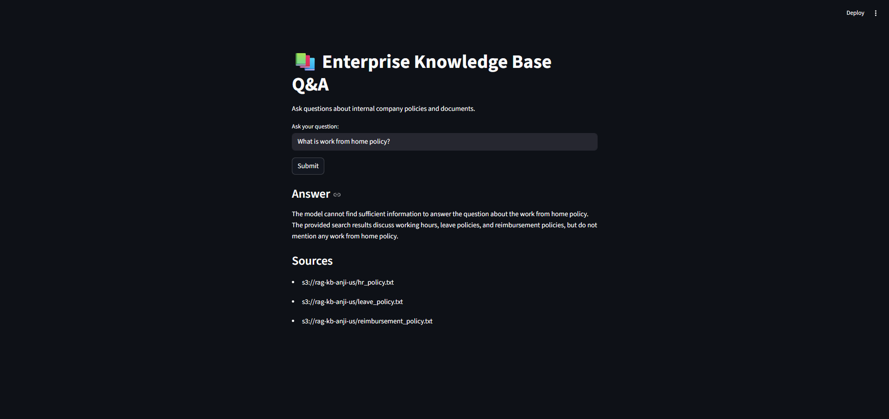
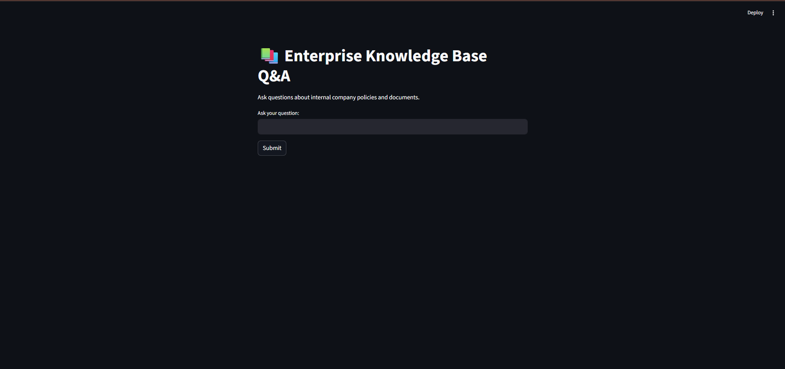

# Enterprise Knowledge Base Q&A System using Amazon Bedrock Knowledge Bases (RAG)

## Project Overview

This project implements an **Enterprise Knowledge Base Question-Answering System** using **Amazon Bedrock Knowledge Bases (RAG)**.

The system enables users to ask natural language questions about internal company documents and receive **accurate, citation-backed responses**.

It combines:

* **Semantic search (vector retrieval)**
* **Large Language Models (LLMs)**
* **Cloud deployment on AWS**

---
## Key Highlights

- Built an end-to-end **RAG system** for enterprise document question answering
- Used **Amazon Bedrock Knowledge Bases**, **Amazon S3**, **OpenSearch Serverless**, **EC2**, and **Streamlit**
- Returned **citation-backed responses** for internal company documents
- Designed to reduce hallucinations for unknown or unsupported queries
- Deployed as a cloud-based application on **AWS EC2**

---

## Business Context

Traditional enterprise search systems rely on keyword matching, which:

* fails to understand context
* returns irrelevant results

At the same time, LLMs:

* can generate incorrect answers (hallucinations)
* lack access to private company data

---

### Solution

Amazon Bedrock Knowledge Bases solve both problems by:

* retrieving relevant information using embeddings
* generating grounded responses using LLMs

---

## Problem Statement

Develop a production-ready **RAG (Retrieval-Augmented Generation)** system that:

* allows employees to query internal documents
* returns accurate answers with source citations
* avoids hallucinations for unknown queries

---

## Workflow

1. Upload enterprise documents to **Amazon S3**
2. Connect the S3 data source to **Amazon Bedrock Knowledge Base**
3. Store vector embeddings in **Amazon OpenSearch Serverless**
4. Accept user questions through the **Streamlit interface**
5. Send the query to **Amazon Bedrock Agent Runtime**
6. Retrieve relevant document chunks from the knowledge base
7. Generate a grounded response using retrieved context
8. Return the final answer with **source citations**

---

## Architecture

```text
User
  ↓
Streamlit Web App
  ↓
Amazon Bedrock Agent Runtime
  ↓
Bedrock Knowledge Base
  ↓
OpenSearch Serverless (Vector Store)
  ↓
Amazon S3 (Private Documents)
  ↓
Response with Citations
```

---

## AWS Services Used

* **Amazon S3** → stores internal documents
* **Amazon Bedrock Knowledge Base** → managed RAG system
* **Amazon OpenSearch Serverless** → vector database
* **Amazon EC2** → hosts the application
* **AWS IAM** → secure access control

---

## Tech Stack

- Python
- Streamlit
- Boto3
- Amazon Bedrock Knowledge Bases
- Amazon S3
- Amazon OpenSearch Serverless
- Amazon EC2
- AWS IAM

---


## Project Structure

```text
rag_app/
│── app.py               # Streamlit frontend
│── backend.py           # Bedrock integration
│── requirements.txt     # Dependencies
│── README.md
```

---

## Features

### Intelligent Search

* Semantic understanding using embeddings
* Context-aware responses

### Citation-Based Answers

* Displays source documents (S3 URIs)
* Ensures transparency

### Hallucination Control

* Returns safe responses when data is missing

### Cloud Deployment

* Fully deployed on AWS EC2
* Accessible via browser

---

## Sample Documents Used

The knowledge base was tested using sample enterprise documents such as:

- HR policy
- Leave policy
- Reimbursement policy

These documents were stored in **Amazon S3** and used as the knowledge source for question answering.

---

## Live Demo

Application URL:  
http://3.93.74.210:8501

> Note: The EC2 instance may be stopped to reduce cost, so the live demo may not always be available.

---

## Screenshots

### Leave Policy Query


---

### Reimbursement Policy Query


---

### Working Hours (HR Policy)


---

### Multi-Document Summary


---

### No Data / Hallucination Control


---

### Final Application Output (Streamlit UI)


---

## Sample Questions

```text
What is leave policy?
What is reimbursement policy?
What are the working hours?
Summarize all company policies.
What is work from home policy?
```

---

## Results

- Successfully retrieved relevant answers from internal enterprise documents
- Generated **citation-backed responses** using Amazon Bedrock Knowledge Bases
- Supported **multi-document summarization**
- Returned safe fallback responses for unsupported questions
- Demonstrated a working **end-to-end enterprise RAG pipeline** on AWS

---

## Setup Instructions

### Local Setup

```bash
pip install -r requirements.txt
streamlit run app.py
```

---

### AWS Deployment (EC2)

1. Launch EC2 instance
2. Connect via SSH
3. Install dependencies
4. Configure AWS credentials
5. Run Streamlit app:

```bash
streamlit run app.py --server.port 8501 --server.address 0.0.0.0
```

---

## Security Considerations

* IAM-based access control
* Private documents stored in S3
* Credentials managed securely

---


## Challenges Faced

- Configuring the knowledge base and vector store correctly
- Handling permission issues related to **IAM** and **OpenSearch Serverless**
- Ensuring the system returned **grounded answers with citations**
- Managing deployment on **EC2** and securely configuring cloud access
- Designing the application to handle unknown queries safely

---

## Future Enhancements

* Add authentication (login system)
* Use IAM roles instead of access keys
* Deploy with HTTPS and custom domain
* Improve UI/UX
* Add chat history and session memory

---


## Conclusion

This project demonstrates a practical **enterprise RAG application** built using **Amazon Bedrock Knowledge Bases**. It combines semantic retrieval, grounded generation, cloud deployment, and citation-backed answers to solve real-world enterprise search problems.

It successfully:

* bridges the gap between LLMs and private enterprise data
* provides accurate, context-aware answers
* reduces hallucination risks
* delivers a scalable cloud-based solution

---

## Author

**Embadi Anji**

- GitHub: https://github.com/Anjiembadi
- LinkedIn: https://www.linkedin.com/in/embadi-anji-31122531a

---

## Acknowledgements

Built using AWS Bedrock and modern Generative AI concepts.
